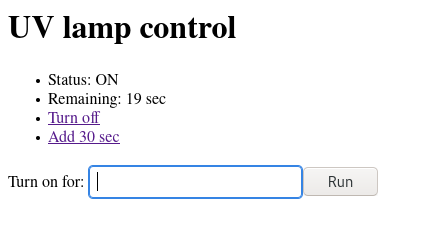

# MicroPython Relay/Sonoff countdown timer

Countdown timer for a Sonoff switch or a random relay, written in MicroPython.

### Features

- Simple countdown timer
- Relay is off when the device is powered. Press the button to add 30 seconds, or a different customizable time increment
- Hold the button to turn it off
- Connect it to Wi-Fi to control it using a simple web UI



Edit the variables at the beginning of the script to customize.

Then, in your `boot.py` add the following code to run it:

```python
import timer
timer.main()
```

**DO NOT EXPOSE IT TO THE PUBLIC INTERNET!**

The web server is extremely basic and intended to be used in private networks only!

## Requires uasyncio!

Uasyncio is included in MicroPython builds only for ESP8266/ESP32 boards with **1MB or more flash**.

For **ESP8266 boards with 512KB of flash** such as the **Sonoff Basic**, you need to rebuild MicroPython yourself, or you can use my build here (MicroPython v1.13): [esp8266-512KB-uasyncio.bin](https://raw.githubusercontent.com/Depau/upython-relay-timer/main/esp8266-512KB-uasyncio.bin)

### Build instructions

I created a patch that disables a few unused drivers, TLS supports (it's not very good anyway) and the WebREPL to reclaim some space, and adds the `uasyncio` module. You can use [rshell](https://github.com/dhylands/rshell) as a replacement for the WebREPL to edit the files.

Building it is just a matter of running the following steps on GNU/Linux (requires `docker`, `git` and `esptool`).

You can copy the script into the `ports/esp8266/modules` directory to pre-freeze it and include it in the firmware, but you need to reflash it every time you want to perform any changes.

```bash
git clone https://github.com/micropython/micropython.git --recursive
git clone https://github.com/micropython/micropython-lib.git --recursive
git clone https://github.com/Depau/upython-relay-timer.git
cd micropython
git am < ../upython-relay-timer/0001-Slim-ESP8266-with-uasyncio-built-in.patch
alias esp='docker run --rm -v $HOME:$HOME -u $(id -u) -w $(pwd) larsks/esp-open-sdk'
esp make -j12 -C ports/esp8266 BOARD=GENERIC_SLIM
```

### Flashing on Sonoff Basic or ESP8266 with <= 512KB flash

You can flash it to your Sonoff, if you built it yourself the firmware will be located at `ports/esp8266/build-GENERIC_SLIM/firmware-combined.bin`, otherwise you can use my build.

Follow the official [MicroPython instructions](http://docs.micropython.org/en/latest/esp8266/tutorial/intro.html#deploying-the-firmware).

[Here](https://randomnerdtutorials.com/how-to-flash-a-custom-firmware-to-sonoff/) is also a guide to flash a Sonoff by soldering the UART header, the header might be in a slightly different location but otherwise it's the same.

```bash

esptool.py --port /dev/ttyUSBx erase_flash
esptool.py --port /dev/ttyUSBx --baud 460800 write_flash --flash_size=detect 0 ports/esp8266/build-GENERIC_SLIM/firmware-combined.bin
```

## Other boards

If you are using an ESP8266 with 1MB or more of flash, there's no need to create a custom build. If you're using an ESP32 with 512KB, you're on your own, read my patch and perform the same things on the ESP32 port.

In short you can copy the 1MB build configurations, make it use the 512KB linker script and remove unnecessary modules such as NeoPixel driver, WebREPL, ussl (basic TLS implementation), etc.

## License

GNU Affero General Public License 3.0
